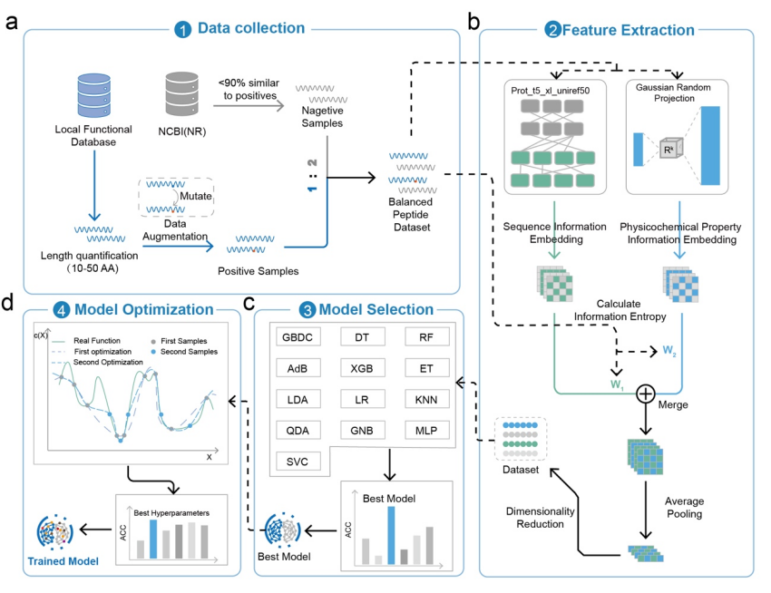

# PepFuncML

PepFuncML is a peptide-function prediction pipeline that combines protein language model embeddings, handcrafted residue descriptors, and classical machine learning to build task-specific binary classifiers for bioactive peptides.

## Overview Figure



## Abstract

This repository implements an end-to-end workflow for peptide activity modeling across multiple functional categories, including anti-cancer, anti-microbial, anti-oxidant, and anti-viral peptides. The pipeline starts from curated peptide datasets, balances sequence-length distributions with conservative mutation strategies, generates negative samples from external FASTA resources, extracts numerical representations with ProtT5 and residue-level descriptor fusion, and then benchmarks, tunes, validates, and deploys machine learning models for downstream prediction.

The codebase is organized as a practical research pipeline rather than a packaged software library. Each stage of the workflow is implemented as a standalone script so that data preparation, feature generation, model selection, and prediction can be run independently.

## Highlights

- Multi-task peptide classification across several biological activity categories.
- Hybrid feature construction from ProtT5 embeddings and amino-acid descriptor statistics.
- Sequence balancing through conservative amino-acid mutation strategies.
- Negative-sample generation with sequence-similarity control.
- Comparative evaluation of dimensionality reduction and classical machine learning models.
- Inference support for FASTA files and precomputed fragment tables.

## Architecture Overview

The repository follows a four-stage workflow: data collection, feature extraction, model selection, and model optimization. Positive peptide datasets are balanced through conservative mutation, negative samples are generated under sequence-similarity constraints, sequence representations are constructed from ProtT5 embeddings and physicochemical descriptors, and task-specific models are then selected and optimized for final prediction.

## Repository Layout

- data/: Data preparation, dataset analysis, augmentation, negative-sample generation, and feature extraction.
- data/base/: Original positive peptide datasets.
- data/embance_data/: Augmented positive datasets generated by conservative sequence mutation.
- data/neg_base_data/: Negative datasets plus related analysis outputs.
- data/embedding/: Dataset merging, feature extraction, dimensionality reduction experiments, and embedded feature tables.
- model/: Model comparison, validation summaries, and trained models.
- optim_parameters/: Bayesian hyperparameter search outputs and validation scripts for tuned models.
- train/: Final model training and evaluation artifacts.
- predict/: Inference scripts for external peptide sequences.

## Method Summary

### 1. Dataset Construction

Positive peptide datasets are stored as CSV files and may be expanded through conservative amino-acid substitutions to reduce imbalance across peptide-length groups. Negative samples are extracted from FASTA sequences while filtering out fragments with high similarity to the positive reference peptides.

### 2. Feature Engineering

The main feature extraction workflow uses ProtT5 to embed peptide sequences and, in some scripts, combines those embeddings with handcrafted 1024-dimensional residue descriptors. Mean pooling is used to convert variable-length sequence representations into fixed-length vectors for downstream learning.

### 3. Representation and Model Search

The repository compares PCA, UMAP, and t-SNE for dimensionality reduction and evaluates multiple classifiers including logistic regression, decision trees, random forests, gradient boosting, AdaBoost, extra trees, SVM, KNN, Gaussian Naive Bayes, LDA, QDA, MLP, and XGBoost.

### 4. Tuning and Validation

For each peptide task, the selected model can be further optimized with Bayesian hyperparameter search. Cross-validation scripts are included to assess both selected and tuned models across the available datasets.

### 5. Inference

Prediction scripts support two common usage modes: generating sequence fragments directly from FASTA files or scoring an existing table of peptide fragments. Outputs are written as CSV files containing class predictions and positive-class probabilities for each trained model.

## Dataset

The repository currently contains multiple peptide activity datasets and their derived artifacts.

- Positive peptide data are organized under the base and enhanced data folders.
- Negative peptide data are generated from external FASTA sources with a similarity threshold against positive samples.
- Intermediate outputs include balanced datasets, labeled merged datasets, embedded features, dimensionality-reduction tables, and evaluation summaries.

If you publish this repository, it is worth adding a short description of the source database, inclusion criteria, duplicate handling, and train-validation split policy in this section.

## Results

The current repository already includes model summary CSV files, tuned hyperparameter files, embedded datasets, and evaluation outputs generated by the training scripts. For a paper-style presentation, this section can be expanded with:

- A benchmark table comparing model accuracy across peptide tasks.
- Precision-recall curves or confusion-matrix figures for the final selected models.
- An ablation comparison between raw embeddings, descriptor fusion, and dimensionality reduction settings.

If you want, I can also help convert the existing CSV result files into a compact Markdown results table for this section.

## Main Scripts

### Data Analysis and Augmentation

- data/base_analysis/base_analysis.py: Computes peptide-length distributions and exports summary plots and CSV tables.
- data/base_analysis/embance_data.py: Balances datasets using conservative single-site amino-acid substitutions.
- data/base_analysis/generate_peptides.py: Samples synthetic peptide sequences from a recurrent generator model.
- data/embancd_data.py: Creates multi-site conservative mutations for additional dataset balancing.

### Dataset Construction and Feature Extraction

- data/embedding/get_all_data.py: Merges positive and negative CSV files into labeled training tables.
- data/embedding/feature_extract.py: Generates peptide features from ProtT5 embeddings and residue descriptor fusion.
- data/embedding/select_mothod.py: Benchmarks dimensionality reduction strategies before classification.
- data/neg_base_data/get_data.py: Builds negative peptide datasets from FASTA inputs with similarity filtering.
- data/neg_base_data/base_analysis.py: Plots sequence-length distributions for generated negative datasets.

### Modeling

- model/model_select.py: Compares classifier families for each peptide task.
- model/model_valid.py: Validates selected models with cross-validation.
- optim_parameters/optim_parameters.py: Runs Bayesian hyperparameter optimization for selected models.
- optim_parameters/model_valid.py: Validates tuned models with cross-validation.
- train/model_train.py: Trains final models and exports confusion matrices and precision-recall curves.

### Prediction

- predict/feature_extract.py: Produces inference-time peptide embeddings and PCA projections.
- predict/predict_run_fasta.py: Scores fragments generated from FASTA sequences.
- predict/predict_run_fragments.py: Scores peptide fragment tables stored in CSV format.

## Quick Start

### 1. Install Dependencies

```bash
pip install -r requirements.txt
```

### 2. Review Local Paths

Some scripts reference local pretrained model directories and PCA artifact paths. Before running the pipeline on a new machine, update hard-coded paths in the source files to match your environment.

### 3. Typical Workflow

```bash
python data/base_analysis/embance_data.py
python data/neg_base_data/get_data.py
python data/embedding/get_all_data.py
python data/embedding/feature_extract.py
python model/model_select.py
python optim_parameters/optim_parameters.py
python train/model_train.py
```

### 4. Run Prediction

```bash
python predict/predict_run_fasta.py
```

or

```bash
python predict/predict_run_fragments.py
```

## Inputs and Outputs

### Inputs

- Peptide CSV files with sequence columns such as seq.
- FASTA files used to construct negative peptide fragments or run prediction.
- Local ProtT5 model files.
- Optional amino-acid descriptor CSV files.

### Outputs

- Balanced peptide datasets.
- Negative peptide CSV files.
- Embedded feature matrices.
- Dimensionality-reduction comparison tables.
- Model selection summaries.
- Tuned hyperparameter JSON files.
- Confusion matrices and precision-recall curves.
- Prediction CSV files containing labels and probabilities.

## Dependencies

The dependency list used by this repository is provided in requirements.txt and is based on the modules imported across the current codebase. Key third-party libraries include PyTorch, Transformers, scikit-learn, UMAP, XGBoost, scikit-optimize, matplotlib, seaborn, pandas, NumPy, joblib, and python-Levenshtein.

## Citation

If you use this repository in academic work, cite the corresponding paper or project release. A BibTeX entry can be added here once the manuscript, preprint, or DOI is available.

```bibtex
@misc{pepfuncml,
	title  = {PepFuncML: Peptide Function Prediction with Protein Language Model Features and Classical Machine Learning},
	author = {Your Name or Team Name},
	year   = {2026},
	note   = {GitHub repository}
}
```

## Reproducibility Notes

- The repository is script-oriented and assumes fixed folder names across multiple stages.
- Some files use relative paths while others use absolute paths tied to a local machine.
- Generated artifacts and datasets are already present in the repository structure; you may want to exclude large derived files from future Git history.
- For public release, replacing hard-coded paths with a configuration file would make the project easier to reproduce.

## Documentation Status

All Python scripts in this repository now include English module descriptions, function docstrings, and key inline comments to improve readability for external reviewers and GitHub visitors.

